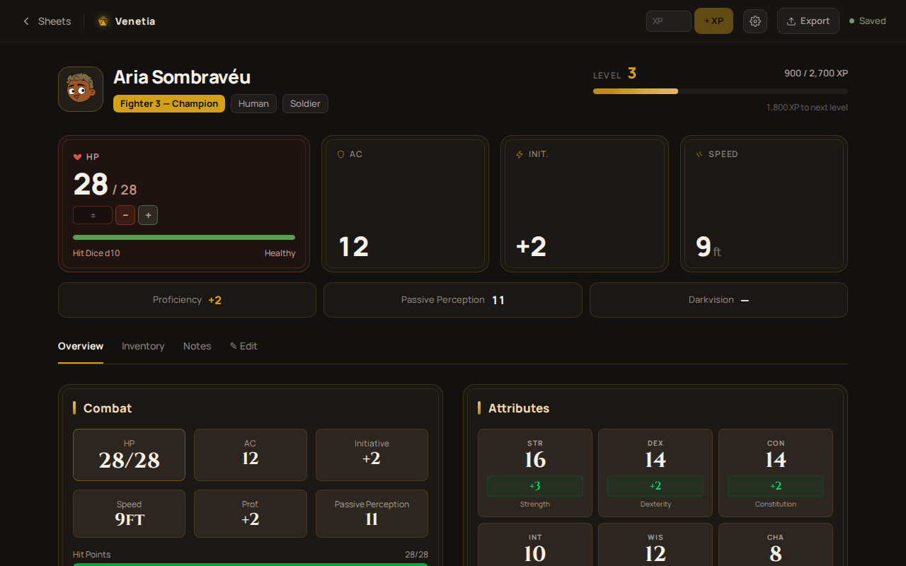
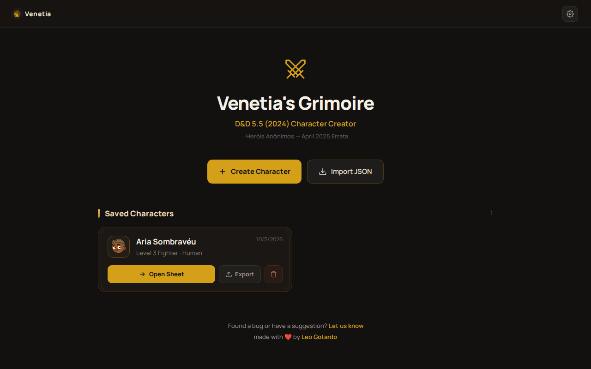
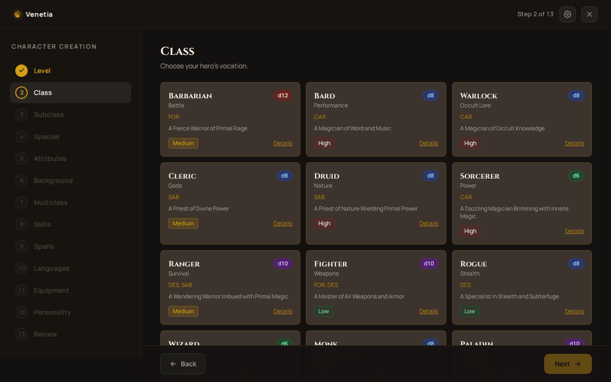
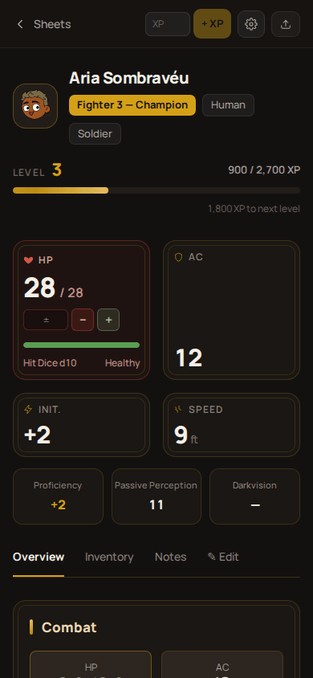

<div align="center">


# Venetia's Grimoire

**Character creator and play sheet for D&D 5.5 (2024)**

[](https://github.com/LeoGotardo/venetia-grimory/releases/latest)
[](https://github.com/LeoGotardo/venetia-grimory/actions/workflows/release.yml)
[](https://venetia.leogotardo.com.br)
<br/>


[Português](README.md) · **English**



</div>

---

## Overview

### Project name

**Venetia's Grimoire** (`venetia-grimory`). In Portuguese, *Grimório de Venetia*. Android package:
`com.venetia.grimory`.

### Description

A single-page app (SPA) that builds **Dungeons & Dragons 5.5 (2024 edition)** characters and tracks
them at the table. A 13-step wizard assembles the character applying the Player's Handbook rules;
the play sheet then tracks hit points, class resources, spell slots, inventory and level-ups. It
also exports the official character sheet as a PDF.

There is no backend and no account: everything lives in the browser's `localStorage` (or the
WebView's, inside the app). It runs as a website and as an Android app packaged with Capacitor.

| Home | Wizard | Phone |
|:---:|:---:|:---:|
|  |  |  |

### Contents

- [Overview](#overview)
- [Environment](#environment) — [development](#development-setup) · [production](#production-setup) · [build from scratch](#building-from-scratch)
- [Operations](#operations) — [boot](#boot-workflow) · [scripts](#available-scripts) · [update and rollback](#update-and-rollback) · [diagnostics](#diagnostic-commands) · [paths](#useful-paths-runtime-and-build)
- [Info](#info) — [paths](#useful-paths-configuration-and-data) · [access](#logins-and-passwords)
- [Particulars](#particulars)

### Purpose

**What it does:**

- **Guided 13-step creation:** level, class, subclass, species, abilities (standard array, 4d6 or
  point buy), background, multiclass, skills, spells, languages, equipment, personality and review.
  Every step applies the 2024 rules: proficiencies, origin feat, the background's +3, multiclass
  prerequisites.
- **Play sheet:** damage and healing, temporary HP, hit dice, short and long rests, class resources
  and spell slots in three separate pools (Spellcasting, Pact Magic and free casts). It also covers
  inventory with weight and coins, magic item charges, XP, and level-up with an ASI or feat choice.
- **Full editing** after the wizard, through the *Edit* tab.
- **Official sheet PDF** in PT-BR or EN, in two modes: complete (flattened, for archiving) or for
  printing (blank where values change during play).
- **Backup** of each character as JSON, for export and import.
- **Interface and game data** in Portuguese and English.

**Who it's for:** D&D 5.5 players and DMs who want to build a character without getting a rule
wrong and track it at the table, on a computer or a phone, with no sign-up and no internet once
loaded.

---

## Environment

### Development setup

**Prerequisites**

| Tool | Version | For |
|---|---|---|
| Node.js | 22 or later (required by the Capacitor 8 CLI; there's an `.nvmrc`) | everything |
| npm | bundled with Node | dependencies |
| JDK | 21 | building the APK only |
| Android SDK | recent build-tools, `compileSdk 36` | building the APK only |
| `gh` (GitHub CLI) | logged in as the repository owner | releases only |

```bash
git clone https://github.com/LeoGotardo/venetia-grimory.git
cd venetia-grimory
npm install
npm run dev            # http://localhost:5173
```

There is no `.env`: the app reads no environment variables.

**Tests**

```bash
npm test               # vitest: rules, recalculation, store actions, catalog, i18n keys
npm run lint
npx playwright install chromium   # once, for e2e
npm run test:e2e -- --workers=1   # starts its own dev server
```

The correctness gate is **`npm run build` + `npm test`**. The build runs the full `tsc -b` before
bundling.

**Android during development**

```bash
npm run build && npx cap sync android
cd android && ./gradlew assembleDebug
adb install -r app/build/outputs/apk/debug/app-debug.apk
```

The Android SDK is looked up in `ANDROID_HOME` or `~/Android/Sdk`. Its local path goes in
`android/local.properties`, which is not tracked.

### Production setup

The app has two production targets, published independently.

**Web: Vercel**

- The Vercel project `venetia-grimory` is linked to the repository through the Git integration.
- Every push to `main` produces a production deploy at **https://venetia.leogotardo.com.br**.
  Branches and PRs get preview deploys.
- Vercel runs `npm run build` and serves `dist/`. `vercel.json` only rewrites every route to
  `index.html`, because routing is client-side (`/novo`, `/ficha/:id`).

**Android: GitHub Releases**

1. **Once**, create the keystore and the secrets:
   ```bash
   ./scripts/setup-release-secrets.sh
   ```
   This creates `~/venetia-release.jks` and stores 4 repository secrets (see
   [Logins and passwords](#logins-and-passwords)).
2. **For each version**, with `main` clean and in sync:
   ```bash
   npm run release                 # patch: v1.0.0 → v1.0.1
   npm run release -- minor        # or major, or v1.4.0
   ```
3. Pushing the `vX.Y.Z` tag triggers `.github/workflows/release.yml`. The workflow runs lint and
   tests, builds the signed `grimorio-de-venetia-vX.Y.Z.apk` and publishes it under
   [Releases](https://github.com/LeoGotardo/venetia-grimory/releases).

Users install by downloading the APK on their phone. The Play Store is not used.

### Building from scratch

Starting from a machine with nothing installed (Ubuntu or Debian):

```bash
# 1. Tools
sudo apt install -y git openjdk-21-jdk unzip
# Node 22 (via nvm, for example)
curl -o- https://raw.githubusercontent.com/nvm-sh/nvm/v0.40.1/install.sh | bash
nvm install 22
# Android SDK: install Android Studio, or just the command-line tools, then:
#   sdkmanager "platform-tools" "platforms;android-36" "build-tools;36.0.0"
export ANDROID_HOME="$HOME/Android/Sdk"

# 2. Code and dependencies
git clone https://github.com/LeoGotardo/venetia-grimory.git && cd venetia-grimory
npm ci

# 3. Web
npm run build                  # → dist/

# 4. Android, debug
npx cap sync android
(cd android && ./gradlew assembleDebug)   # → android/app/build/outputs/apk/debug/app-debug.apk

# 5. Android, signed release (same as CI)
nvm use                                    # Node 22
VERSION=v1.0.0 ./scripts/build-android-release.sh   # asks for the password → grimorio-de-venetia-v1.0.0.apk
```

If you change the icon or the splash, regenerate the resources before step 4 with
`npx capacitor-assets generate --android`.

---

## Operations

### Boot workflow

**On the phone (Android app)**

1. The launcher opens `MainActivity`, a Capacitor `BridgeActivity` with no code of its own.
2. The `AppTheme.NoActionBarLaunch` theme shows the splash (a d20 on `#1A1612`) while the WebView
   starts.
3. Capacitor serves the bundle embedded in `assets/public/` from `https://localhost` and loads
   `index.html`. Nothing comes from the network: the app works offline, and the `INTERNET`
   permission (a Capacitor default) only matters for external links such as the feedback form.
4. From here on the flow is the same as in the browser, described below.

**In the browser (and inside the WebView)**

1. **`index.html`** loads `src/main.tsx`.
2. **i18n** (`src/i18n/index.ts`) is the first import. It reads the saved language from
   `localStorage['venetia-config']`, accepting the old format too, and initializes i18next. With
   nothing saved, the language is English.
3. **`useConfigStore`** rehydrates the preferences from the same item, migrating version 0 to 1 if
   needed, and from then on tells i18n when the language changes.
4. **`App`** mounts the `ErrorBoundary`, the `BrowserRouter` and the `Suspense`. Each page is a
   chunk loaded on demand.
5. **The route opens its page:**
   - **`/` (Home):** reads the `dnd_fichas_lista` index, translating old PT items.
   - **`/novo` (Wizard):** creates a new sheet (`createInitialSheet`) if none is open.
   - **`/ficha/:id`:** validates the id and loads `dnd_ficha_<id>`. The sheet goes through
     `migrateSheet` (old format and new fields) and `recalculate` (every derived `_*` field). An
     unknown id leads to the 404 page.
6. **Update check** (Android release build only, online): `UpdatePrompt` queries
   `api.github.com/…/releases/latest` and compares the tag's `versionCode` with the installed one.
   If there's a newer version it shows the prompt; offline, it shows nothing.
7. **Ready.** Every change goes through a `useSheetStore` action, and the store saves itself to
   `localStorage` 500 ms after the last change (`DEBOUNCE_SAVE_MS`).

The PDF templates (~4.5 MB each) and `pdf-lib` are only downloaded when the user asks for the PDF.

### Available scripts

**npm** (`package.json`)

| Command | What it does |
|---|---|
| `npm run dev` | Vite dev server with hot reload on `:5173` |
| `npm run build` | `tsc -b` (full type check) and `vite build` into `dist/` |
| `npm run preview` | serves the built `dist/`, to check the production build |
| `npm test` | Vitest, single run (`src/**/*.test.ts`) |
| `npm run test:watch` | Vitest in watch mode |
| `npm run lint` | ESLint over the project (ignores `dist/` and `android/`) |
| `npm run test:e2e` | Playwright, desktop and mobile, starting the dev server |
| `npm run test:e2e:ui` | Playwright interactive mode |
| `npm run test:e2e:report` | opens the last Playwright HTML report |
| `npm run release` | releases an APK version (see below) |

**Shell and Node** (`scripts/`)

| Script | What it does |
|---|---|
| `scripts/release.sh` | Checks `main` (clean, equal to `origin`, secrets present). Runs lint, tests and build, works out the next version, opens the editor with the commits as a notes draft, creates the annotated tag and pushes it after confirmation. Use `NOTES="..."` to skip the editor. |
| `scripts/build-android-release.sh` | Builds the signed APK for `VERSION=vX.Y.Z`: web build, `cap sync`, `assembleRelease` with a `versionCode` derived from the version, `zipalign`, `apksigner sign` and `verify`. Runs in CI and by hand. |
| `scripts/setup-release-secrets.sh` | Once: creates or validates the keystore and stores the workflow's 4 secrets via `gh`. |
| `scripts/extract-fields.mjs` | Extracts the AcroForm field geometry from a PDF. |
| `scripts/generate-field-map.mjs` | Generates `src/lib/pdf/sheetFields.ts` from that geometry. |
| `scripts/clean-template.mjs` | Strips the sample character from the official PT PDF. |
| `scripts/prepare-template.mjs` | Builds the blank templates that go into `public/`. |

The four PDF scripts are one-off tools. The pipeline is in [`scripts/README.md`](scripts/README.md)
(Portuguese).

### Update and rollback

**Web**

- **Update:** `git push` to `main`. Vercel publishes in about a minute.
- **Rollback:** in the Vercel dashboard, under *Deployments*, pick the previous deploy and use
  *Instant Rollback*. From the CLI, `vercel rollback`. For a lasting fix, `git revert` the commit
  and push.
- **Data:** user data lives in each user's browser, so a deploy never deletes sheets. A new version
  reads old sheets through `migrateSheet`.

**Android**

- **Update:** `npm run release`. When opened online, the app compares the installed version with
  the latest release and offers the update. If the user accepts, the app downloads the APK, asks
  for the "install apps from this source" permission if it hasn't been granted, and opens the
  Android installer. The APK can also be downloaded from the Releases page and installed over the
  old one. That
  only works with the same keystore and a higher `versionCode`, and the `versionCode` comes from the
  tag (`v1.2.3` → `10203`). Sheets are kept.
- **Rebuild a tag** that failed in CI:
  ```bash
  gh workflow run release.yml -f tag=v1.2.3
  ```
- **Rollback:** Android **will not install a lower version over a higher one**. There are two ways:
  1. **Recommended:** revert the problem on `main` and release a new patch version (`git revert …`
     then `npm run release`).
  2. Uninstall and install the old APK from the Releases page. **This deletes the sheets on the
     device**, so export each one as JSON first and import it afterwards.
- **Pull a version:** `gh release delete vX.Y.Z` (the tag stays; remove it with
  `git push --delete origin vX.Y.Z` if you want).

### Diagnostic commands

```bash
# Code health
npm run build && npm test && npm run lint
npx cap doctor                                   # Capacitor and platform versions

# CI and releases
gh run list --workflow release.yml -L 5
gh run view <id> --log-failed                    # only the failed steps
gh release view --json tagName,assets

# APK
AAPT=$(ls -d $ANDROID_HOME/build-tools/* | sort -V | tail -1)
$AAPT/aapt2 dump badging app.apk | grep -E "package|label"     # version and name
$AAPT/apksigner verify --print-certs app.apk                    # who signed it

# App running on the phone (USB with debugging on)
adb devices
adb shell dumpsys package com.venetia.grimory | grep version
adb logcat -s Capacitor Capacitor/Console        # WebView console.log/errors
# WebView DevTools: chrome://inspect in desktop Chrome (debug APK only)

# Web in production
vercel ls venetia-grimory
vercel inspect <deploy-url> --logs
```

In the browser, the data is visible under DevTools → *Application* → *Local Storage*.

### Useful paths (runtime and build)

| Path | Contents |
|---|---|
| DevTools → Console | the app's only logs (`console.error` for a corrupted sheet, for example) |
| `adb logcat` (tag `Capacitor/Console`) | the same logs, in the Android app |
| GitHub → Actions → `release` | APK build log |
| Vercel dashboard → Deployments | web build and runtime log |
| `dist/` | web build |
| `android/app/build/outputs/apk/` | Gradle APKs (`debug/`, `release/`) |
| `grimorio-de-venetia-vX.Y.Z.apk` (root) | signed APK built by hand (git-ignored) |
| `playwright-report/`, `test-results/` | e2e report, videos and screenshots |

---

## Info

### Useful paths (configuration and data)

**Configuration**

| File | For |
|---|---|
| `vite.config.ts` | build, `@/` → `src/` alias |
| `tsconfig.app.json`, `tsconfig.node.json` | TypeScript (project references) |
| `vitest.config.ts`, `vitest.setup.ts` | unit tests (node environment, `localStorage` stub) |
| `playwright.config.ts` | e2e (desktop and mobile projects; port via `E2E_PORT`) |
| `eslint.config.js` | lint |
| `vercel.json` | SPA rewrite |
| `capacitor.config.ts` | `appId`, `appName`, `webDir` |
| `android/app/build.gradle` | `applicationId`; version read from `-PversionCode` and `-PversionName` |
| `android/variables.gradle` | `minSdk 24`, `compileSdk`/`targetSdk 36` |
| `android/app/src/main/res/values*/strings.xml` | app name (EN default, `values-pt` for PT) |
| `assets/` | icon and splash sources (`capacitor-assets`) |
| `.github/workflows/release.yml` | APK build and publishing |
| `src/constants/index.ts` | rule constants, storage keys, feedback form URL |

**User data** (`localStorage`, in the browser or the WebView)

| Key | Contents |
|---|---|
| `dnd_fichas_lista` | sheet index (id, name, class, level, `complete`) |
| `dnd_ficha_<uuid>` | one whole sheet (`CharacterSheet` as JSON) |
| `venetia-config` | preferences (language, weight, coins…), zustand-persist v1 format |

On Android, the WebView's `localStorage` lives in
`/data/data/com.venetia.grimory/app_webview/Default/Local Storage/` (reachable only through
`adb shell run-as` on a debug APK).

**Game data** (in the code, not user-editable)

| Path | Contents |
|---|---|
| `src/data/rules/` | classes, species, backgrounds, feats, progressions, armor (canonical PT) |
| `src/data/rules/translation.ts` | PT → EN dictionary for the rules data |
| `src/data/{items,spells,backgrounds}/{pt,en}/` | localized catalogs |
| `public/sheet-template*.pdf` | blank official sheet templates |

### Logins and passwords

The app has **no login, no users and no server**. There is no root, SSH or remote access to
configure: the web build is static hosting on Vercel, and the Android app asks for no permission
beyond `INTERNET`.

The access that does exist is for administering the project:

| Access | Where | Notes |
|---|---|---|
| Repository and releases | GitHub `LeoGotardo/venetia-grimory` | owner's account; `gh auth login` for the scripts |
| Web hosting | Vercel, project `venetia-grimory` (team `leogotardos-projects`) | owner's account |
| Domain | `leogotardo.com.br` DNS pointing `venetia` at Vercel | owner's registrar |
| Feedback form | Google Forms (`FEEDBACK_FORM_URL`; structure in `docs/bug-report-form.json`) | owner's Google account |
| Release keystore | `~/venetia-release.jks`, alias `venetia` | **the password is not in the repository** |
| Workflow secrets | GitHub → Settings → Secrets → Actions | `ANDROID_KEYSTORE_BASE64`, `ANDROID_KEYSTORE_PASSWORD`, `ANDROID_KEY_ALIAS`, `ANDROID_KEY_PASSWORD` |

> [!WARNING]
> **Keep a backup of the keystore and its password off this machine.** Android refuses an update
> signed by another key. Losing the keystore forces every user to uninstall the app, losing their
> sheets, to install the next version.

---

## Particulars

**Data and rules**

- **Rules data in PT.** The rules data is canonical in Portuguese, because the math compares raw
  strings (`'Leve'`, `'Escudo'`, `barbaro`). English is a whole-string translation layer, and
  anything missing from the dictionary shows in PT.
- **Portuguese names on purpose.** Routes (`/novo`, `/ficha/:id`), `localStorage` keys and
  `data-testid` values stay in Portuguese. Renaming them breaks saved sheets and the e2e suite.
- **Derived fields.** Fields prefixed with `_` are computed by `recalculate` and never edited by
  hand.
- **Three spell slot pools:** Spellcasting, Pact Magic (warlock, refilled on a short rest) and free
  casts. Only the PDF sums them, because the official sheet has a single row per circle.
- **Wizard steps.** The filenames (`Step01Level` … `Step12Review`) don't match the step ids. The
  real order is the `STEPS` array in `src/pages/Wizard.tsx`.

**Storage**

- **Local only.** Clearing the site's data or uninstalling the app deletes the sheets. The backup
  is the JSON export.
- **The site and the app don't share sheets.** Each has its own `localStorage`. To move a sheet,
  export it from one and import it into the other.
- **Old format.** Sheets saved before the PT → EN field rename are converted field by field in
  `src/lib/migrateLegacyPt.ts`.

**PDF**

Two known workarounds, documented in `src/lib/pdf/fillSheet.ts`. Don't remove either of them:

- **Checkboxes.** Their appearance references a missing font, so the marks are drawn as circles on
  the page.
- **Font size.** Each widget carries its own `/DA`, which overrides the field's, so the widget
  `/DA` is deleted when the font is shrunk.
- **Unfilled fields.** Death saves, Heroic Inspiration and attunement are never filled, because the
  app's sheet has no such fields.

**Android**

- **`android/` is tracked.** Unlike a freshly created Capacitor project, the icons, the localized
  name and `build.gradle` live in the repository. Don't run `npx cap add android` over it.
- **The Android project follows the Capacitor 8 template** (AGP 8.13, Gradle 8.14, SDK 36). When
  upgrading Capacitor, diff `android/` against the template in
  `node_modules/@capacitor/cli/assets/android-template.tar.gz`. Don't force `kotlin-stdlib`
  versions: the plugins are compiled with Kotlin 2.x.
- **Self-update.** It lives in `src/lib/appUpdate.ts` and `src/components/ui/UpdatePrompt.tsx`,
  with the local native plugin `AppUpdaterPlugin.java` (registered in `MainActivity`) and the
  `REQUEST_INSTALL_PACKAGES` permission. It only works between APKs signed with the same keystore,
  and the debug APK skips the check. `v1.0.0` doesn't have the feature: users on it have to install
  the next one by hand once.
- **No hardware dependencies.** Only Android 7.0 (API 24) or later.

**Development**

- **E2E with one worker.** The full e2e run with several workers can run out of memory locally. Use
  `--workers=1`, as in the example above.
- **`release.sh` editor.** With no `core.editor` set, git opens vim. To save, `Esc` then `:wq`. To
  switch editors, `git config --global core.editor nano`.
- **Reference files.** `docs/dnd_fluxograma_criacao_personagem.svg` and
  `Venetia - Protótipo.dc.html` are design references and are not part of the build.

Architecture notes and conventions for contributors are in [`CLAUDE.md`](CLAUDE.md).

## Attribution

This work includes material from the System Reference Document 5.2.1 (“SRD 5.2.1”) by Wizards of
the Coast LLC, available at https://www.dndbeyond.com/srd. The SRD 5.2.1 is licensed under the
Creative Commons Attribution 4.0 International License, available at
https://creativecommons.org/licenses/by/4.0/legalcode. The GM area's monster catalog
(`src/data/monsters/`) comes from it, generated by `scripts/srd/generate-monsters.mjs`.

The area map icons (`src/data/areaMap/icons.generated.ts`) come from
[game-icons.net](https://game-icons.net), made by Lorc and Delapouite, under the
[Creative Commons Attribution 3.0](https://creativecommons.org/licenses/by/3.0/) license. They are
generated by `scripts/areamap/generate-icons.mjs` from the curated list in
`scripts/areamap/icons.json`, which records each icon's author. The area map objects (stamps) and
textures are the project's own drawings.
