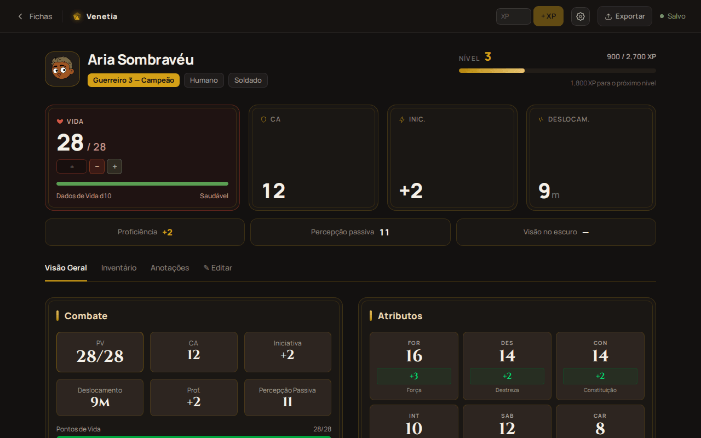
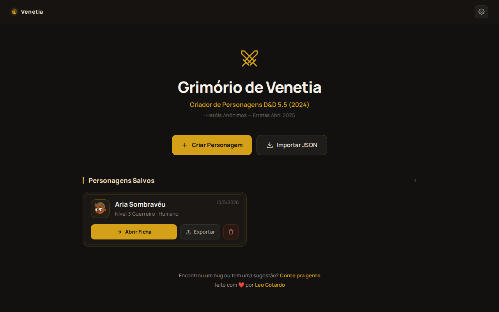
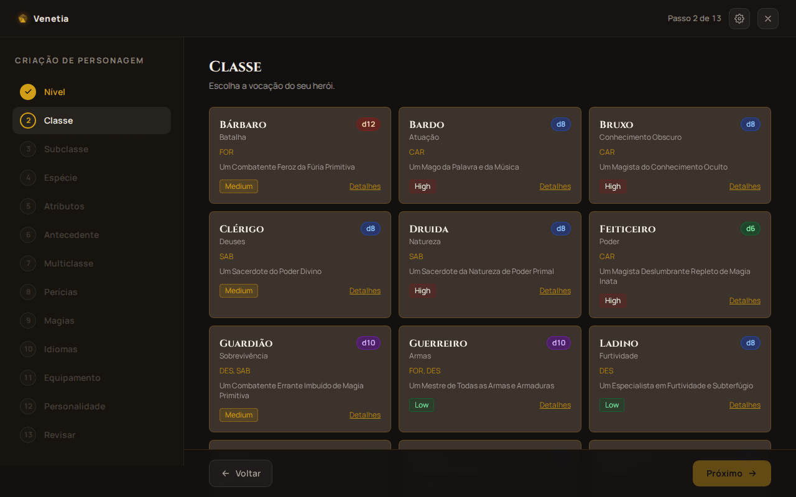
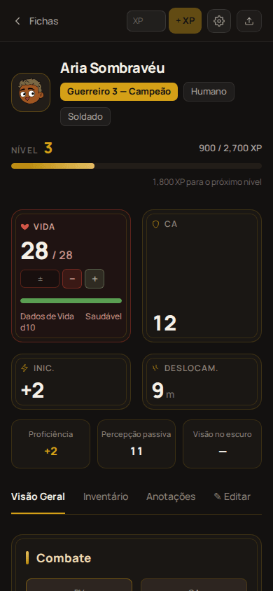

<div align="center">


# Grimório de Venetia

**Criador de personagens e ficha de jogo para D&D 5.5 (2024)**

[](https://github.com/LeoGotardo/venetia-grimory/releases/latest)
[](https://github.com/LeoGotardo/venetia-grimory/actions/workflows/release.yml)
[](https://venetia.leogotardo.com.br)
<br/>


**Português** · [English](README.en.md)



</div>

---

## Visão geral

### Nome do projeto

**Grimório de Venetia** (`venetia-grimory`). Em inglês, *Venetia's Grimoire*. Pacote Android:
`com.venetia.grimory`.

### Descrição

Aplicação de página única (SPA) para criar personagens de **Dungeons & Dragons 5.5 (edição 2024)**
e acompanhá-los durante a sessão. Um assistente de 13 passos monta o personagem aplicando as regras
do Livro do Jogador; depois, a ficha de jogo controla vida, recursos de classe, espaços de magia,
inventário e subida de nível. Exporta a ficha oficial em PDF.

Não há backend nem conta: tudo fica no `localStorage` do navegador (ou do WebView, no app). Roda
como site e como app Android empacotado com Capacitor.

| Início | Assistente | Celular |
|:---:|:---:|:---:|
|  |  |  |

### Sumário

- [Visão geral](#visão-geral)
- [Ambiente](#ambiente) — [desenvolvimento](#setup-para-desenvolvimento) · [produção](#setup-para-produção) · [build do zero](#como-fazer-a-build-do-zero)
- [Operação](#operação) — [boot](#workflow-de-boot) · [scripts](#scripts-disponíveis) · [update e rollback](#update-e-rollback) · [diagnóstico](#comandos-de-diagnóstico) · [paths](#paths-úteis-execução-e-build)
- [Info](#info) — [paths](#paths-úteis-configuração-e-dados) · [acessos](#login-e-senhas)
- [Particularidades](#particularidades)

### Função

**O que faz:**

- **Criação guiada em 13 passos:** nível, classe, subclasse, espécie, atributos (conjunto padrão,
  4d6 ou compra de pontos), antecedente, multiclasse, perícias, magias, idiomas, equipamento,
  personalidade e revisão. Cada passo aplica as regras de 2024: proficiências, talento de origem,
  +3 do antecedente, pré-requisitos de multiclasse.
- **Ficha de jogo:** dano e cura, PV temporários, dados de vida, descansos curto e longo, recursos
  de classe e espaços de magia em três reservas separadas (Conjuração, Magia de Pacto e conjurações
  gratuitas). Também cobre inventário com peso e moedas, cargas de itens mágicos, XP e subida de
  nível com escolha de ASI ou talento.
- **Edição completa** depois do assistente, pela aba *Editar*.
- **PDF da ficha oficial** em PT-BR ou EN, em dois modos: completo (achatado, para arquivar) ou
  para impressão (sem o que muda em jogo).
- **Backup** de cada personagem como JSON, para exportar e importar.
- **Interface e dados de jogo** em português e inglês.

**Para quem:** jogadores e mestres de D&D 5.5 que querem montar um personagem sem errar regra e
acompanhá-lo na mesa, no computador ou no celular, sem cadastro e sem internet depois de carregado.

---

## Ambiente

### Setup para desenvolvimento

**Pré-requisitos**

| Ferramenta | Versão | Para quê |
|---|---|---|
| Node.js | 22 ou superior (exigência da CLI do Capacitor 8; há `.nvmrc`) | tudo |
| npm | o que vem com o Node | dependências |
| JDK | 21 | só para gerar o APK |
| Android SDK | build-tools recentes, `compileSdk 36` | só para gerar o APK |
| `gh` (GitHub CLI) | logado na conta dona do repositório | só para releases |

```bash
git clone https://github.com/LeoGotardo/venetia-grimory.git
cd venetia-grimory
npm install
npm run dev            # http://localhost:5173
```

Não há `.env`: o app não lê nenhuma variável de ambiente.

**Testes**

```bash
npm test               # vitest: regras, recálculo, ações do store, catálogo, chaves de i18n
npm run lint
npx playwright install chromium   # uma vez, para o e2e
npm run test:e2e -- --workers=1   # sobe o próprio dev server
```

O gate de correção é **`npm run build` + `npm test`**. O build roda o `tsc -b` completo antes do
bundle.

**Android em desenvolvimento**

```bash
npm run build && npx cap sync android
cd android && ./gradlew assembleDebug
adb install -r app/build/outputs/apk/debug/app-debug.apk
```

O Android SDK é procurado em `ANDROID_HOME` ou em `~/Android/Sdk`. O caminho local fica em
`android/local.properties`, que não é versionado.

### Setup para produção

O app tem dois alvos de produção, publicados de formas independentes.

**Web: Vercel**

- O projeto Vercel `venetia-grimory` está ligado ao repositório pela integração Git.
- Todo push na `main` gera um deploy de produção em **https://venetia.leogotardo.com.br**. Branches
  e PRs geram deploys de preview.
- A Vercel roda `npm run build` e serve `dist/`. O `vercel.json` só reescreve todas as rotas para
  `index.html`, porque o roteamento é do lado do cliente (`/novo`, `/ficha/:id`).

**Android: GitHub Releases**

1. **Uma vez só**, crie a keystore e os secrets:
   ```bash
   ./scripts/setup-release-secrets.sh
   ```
   Isso cria `~/venetia-release.jks` e grava 4 secrets no repositório (veja
   [Login e senhas](#login-e-senhas)).
2. **A cada versão**, com a `main` limpa e sincronizada:
   ```bash
   npm run release                 # patch: v1.0.0 → v1.0.1
   npm run release -- minor        # ou major, ou v1.4.0
   ```
3. O push da tag `vX.Y.Z` dispara `.github/workflows/release.yml`. O workflow roda lint e testes,
   gera `grimorio-de-venetia-vX.Y.Z.apk` assinado e publica em
   [Releases](https://github.com/LeoGotardo/venetia-grimory/releases).

O usuário instala baixando o APK pelo celular. A Play Store não é usada.

### Como fazer a build do zero

Partindo de uma máquina sem nada instalado (Ubuntu ou Debian):

```bash
# 1. Ferramentas
sudo apt install -y git openjdk-21-jdk unzip
# Node 22 (via nvm, por exemplo)
curl -o- https://raw.githubusercontent.com/nvm-sh/nvm/v0.40.1/install.sh | bash
nvm install 22
# Android SDK: instale o Android Studio, ou só as command-line tools, e depois:
#   sdkmanager "platform-tools" "platforms;android-36" "build-tools;36.0.0"
export ANDROID_HOME="$HOME/Android/Sdk"

# 2. Código e dependências
git clone https://github.com/LeoGotardo/venetia-grimory.git && cd venetia-grimory
npm ci

# 3. Web
npm run build                  # → dist/

# 4. Android, debug
npx cap sync android
(cd android && ./gradlew assembleDebug)   # → android/app/build/outputs/apk/debug/app-debug.apk

# 5. Android, release assinado (o mesmo que o CI faz)
nvm use                                    # Node 22
VERSION=v1.0.0 ./scripts/build-android-release.sh   # pede a senha → grimorio-de-venetia-v1.0.0.apk
```

Se mudar o ícone ou o splash, regenere os recursos antes do passo 4 com
`npx capacitor-assets generate --android`.

---

## Operação

### Workflow de boot

**No celular (app Android)**

1. O launcher abre `MainActivity`, uma `BridgeActivity` do Capacitor sem código próprio.
2. O tema `AppTheme.NoActionBarLaunch` mostra o splash (d20 sobre `#1A1612`) enquanto o WebView
   inicializa.
3. O Capacitor serve o bundle embutido em `assets/public/` a partir de `https://localhost` e carrega
   `index.html`. Nada vem da rede: o app funciona offline, e a permissão `INTERNET` (padrão do
   Capacitor) só importa para links externos, como o formulário de feedback.
4. A partir daqui o fluxo é o mesmo do navegador, descrito abaixo.

**No navegador (e dentro do WebView)**

1. **`index.html`** carrega `src/main.tsx`.
2. **i18n** (`src/i18n/index.ts`) é o primeiro import. Ele lê o idioma salvo em
   `localStorage['venetia-config']`, aceitando também o formato antigo, e inicializa o i18next. Se
   não houver nada salvo, o idioma é inglês.
3. **`useConfigStore`** reidrata as preferências do mesmo item, migrando a versão 0 para a 1 se
   preciso, e passa a avisar o i18n quando o idioma muda.
4. **`App`** monta o `ErrorBoundary`, o `BrowserRouter` e o `Suspense`. Cada página é um chunk
   carregado sob demanda.
5. **A rota abre a página:**
   - **`/` (Home):** lê o índice `dnd_fichas_lista`, traduzindo itens antigos em PT.
   - **`/novo` (Assistente):** cria uma ficha nova (`createInitialSheet`) se nenhuma estiver aberta.
   - **`/ficha/:id`:** valida o id e carrega `dnd_ficha_<id>`. A ficha passa por `migrateSheet`
     (formato antigo e campos novos) e por `recalculate` (todos os campos derivados `_*`). Um id
     inexistente leva ao 404.
6. **Verificação de atualização** (só no app Android de release, com internet):
   `UpdatePrompt` consulta `api.github.com/…/releases/latest` e compara o `versionCode` da tag com o
   instalado. Se houver versão nova, mostra o aviso; sem conexão, não mostra nada.
7. **Pronto.** Cada alteração passa por uma ação do `useSheetStore`, e o store salva sozinho no
   `localStorage` 500 ms depois da última mudança (`DEBOUNCE_SAVE_MS`).

Os modelos de PDF (~4,5 MB cada) e o `pdf-lib` só são baixados quando o usuário pede o PDF.

### Scripts disponíveis

**npm** (`package.json`)

| Comando | O que faz |
|---|---|
| `npm run dev` | servidor Vite com hot reload em `:5173` |
| `npm run build` | `tsc -b` (checagem de tipos completa) e `vite build` para `dist/` |
| `npm run preview` | serve o `dist/` gerado, para conferir a build de produção |
| `npm test` | Vitest, uma rodada (`src/**/*.test.ts`) |
| `npm run test:watch` | Vitest em modo watch |
| `npm run lint` | ESLint no projeto (ignora `dist/` e `android/`) |
| `npm run test:e2e` | Playwright, desktop e mobile, subindo o dev server |
| `npm run test:e2e:ui` | Playwright no modo interativo |
| `npm run test:e2e:report` | abre o último relatório HTML do Playwright |
| `npm run release` | lança uma versão do APK (veja abaixo) |

**Shell e Node** (`scripts/`)

| Script | O que faz |
|---|---|
| `scripts/release.sh` | Confere a `main` (sem alterações, igual ao `origin`, secrets presentes). Roda lint, testes e build, calcula a próxima versão, abre o editor com os commits como rascunho das notas, cria a tag anotada e a envia depois de confirmar. Use `NOTES="..."` para pular o editor. |
| `scripts/build-android-release.sh` | Gera o APK assinado de `VERSION=vX.Y.Z`: build web, `cap sync`, `assembleRelease` com `versionCode` derivado da versão, `zipalign`, `apksigner sign` e `verify`. Roda no CI e à mão. |
| `scripts/setup-release-secrets.sh` | Uma vez só: cria ou valida a keystore e grava os 4 secrets do workflow pelo `gh`. |
| `scripts/extract-fields.mjs` | Extrai a geometria dos campos AcroForm de um PDF. |
| `scripts/generate-field-map.mjs` | Gera `src/lib/pdf/sheetFields.ts` a partir dessa geometria. |
| `scripts/clean-template.mjs` | Limpa o personagem de exemplo do PDF oficial PT. |
| `scripts/prepare-template.mjs` | Monta os modelos em branco que vão para `public/`. |

Os quatro scripts de PDF são de uso pontual. O pipeline está em [`scripts/README.md`](scripts/README.md).

### Update e rollback

**Web**

- **Update:** `git push` na `main`. A Vercel publica em cerca de 1 minuto.
- **Rollback:** no painel da Vercel, em *Deployments*, escolha o deploy anterior e use *Instant
  Rollback*. Pela CLI, `vercel rollback`. Para corrigir de vez, `git revert` do commit e push.
- **Dados:** os dados do usuário ficam no navegador dele, então um deploy nunca apaga fichas. Uma
  versão nova lê fichas antigas por `migrateSheet`.

**Android**

- **Update:** `npm run release`. Ao abrir com internet, o app compara a versão instalada com a
  última release e oferece a atualização. Se o usuário aceitar, o app baixa o APK, pede a permissão
  "instalar apps desta fonte" se ela ainda não foi dada, e abre o instalador do Android. Também dá
  para baixar o APK pela página de Releases e instalar por cima. Isso só funciona se
  for a mesma keystore e um `versionCode` maior, e o `versionCode` sai da tag (`v1.2.3` → `10203`).
  As fichas são mantidas.
- **Refazer o build de uma tag** que falhou no CI:
  ```bash
  gh workflow run release.yml -f tag=v1.2.3
  ```
- **Rollback:** o Android **não instala uma versão menor por cima**. Há dois caminhos:
  1. **Recomendado:** reverta o problema na `main` e lance uma nova versão de patch (`git revert …`
     seguido de `npm run release`).
  2. Desinstale e instale o APK antigo da página de Releases. **Isso apaga as fichas do aparelho**,
     então exporte cada uma em JSON antes e importe depois.
- **Tirar uma versão do ar:** `gh release delete vX.Y.Z` (a tag continua; apague-a com
  `git push --delete origin vX.Y.Z` se quiser).

### Comandos de diagnóstico

```bash
# Saúde do código
npm run build && npm test && npm run lint
npx cap doctor                                   # versões do Capacitor e plataformas

# CI e releases
gh run list --workflow release.yml -L 5
gh run view <id> --log-failed                    # só os passos que falharam
gh release view --json tagName,assets

# APK
AAPT=$(ls -d $ANDROID_HOME/build-tools/* | sort -V | tail -1)
$AAPT/aapt2 dump badging app.apk | grep -E "package|label"     # versão e nome
$AAPT/apksigner verify --print-certs app.apk                    # quem assinou

# App rodando no celular (USB com depuração ativada)
adb devices
adb shell dumpsys package com.venetia.grimory | grep version
adb logcat -s Capacitor Capacitor/Console        # console.log/erros do WebView
# DevTools do WebView: chrome://inspect no Chrome do PC (só em APK de debug)

# Web em produção
vercel ls venetia-grimory
vercel inspect <url-do-deploy> --logs
```

No navegador, os dados podem ser vistos em DevTools → *Application* → *Local Storage*.

### Paths úteis (execução e build)

| Caminho | Conteúdo |
|---|---|
| DevTools → Console | únicos logs do app (`console.error` de ficha corrompida, por exemplo) |
| `adb logcat` (tag `Capacitor/Console`) | os mesmos logs, no app Android |
| GitHub → Actions → `release` | log do build do APK |
| Painel da Vercel → Deployments | log do build web e da execução |
| `dist/` | build web |
| `android/app/build/outputs/apk/` | APKs do Gradle (`debug/`, `release/`) |
| `grimorio-de-venetia-vX.Y.Z.apk` (raiz) | APK assinado gerado à mão (ignorado pelo git) |
| `playwright-report/`, `test-results/` | relatório, vídeos e prints do e2e |

---

## Info

### Paths úteis (configuração e dados)

**Configuração**

| Arquivo | Para quê |
|---|---|
| `vite.config.ts` | build, alias `@/` → `src/` |
| `tsconfig.app.json`, `tsconfig.node.json` | TypeScript (project references) |
| `vitest.config.ts`, `vitest.setup.ts` | testes unitários (ambiente node, stub de `localStorage`) |
| `playwright.config.ts` | e2e (projetos desktop e mobile; porta em `E2E_PORT`) |
| `eslint.config.js` | lint |
| `vercel.json` | rewrite SPA |
| `capacitor.config.ts` | `appId`, `appName`, `webDir` |
| `android/app/build.gradle` | `applicationId`; versão lida de `-PversionCode` e `-PversionName` |
| `android/variables.gradle` | `minSdk 24`, `compileSdk`/`targetSdk 36` |
| `android/app/src/main/res/values*/strings.xml` | nome do app (EN padrão, `values-pt` para PT) |
| `assets/` | fontes do ícone e do splash (`capacitor-assets`) |
| `.github/workflows/release.yml` | build e publicação do APK |
| `src/constants/index.ts` | constantes de regra, chaves de storage, URL do formulário de feedback |

**Dados do usuário** (`localStorage`, no navegador ou no WebView)

| Chave | Conteúdo |
|---|---|
| `dnd_fichas_lista` | índice das fichas (id, nome, classe, nível, `complete`) |
| `dnd_ficha_<uuid>` | uma ficha inteira (`CharacterSheet` em JSON) |
| `venetia-config` | preferências (idioma, peso, moedas…), formato zustand-persist v1 |

No Android, o `localStorage` do WebView fica em
`/data/data/com.venetia.grimory/app_webview/Default/Local Storage/` (acessível só com
`adb shell run-as` em APK de debug).

**Dados de jogo** (no código, não editáveis pelo usuário)

| Caminho | Conteúdo |
|---|---|
| `src/data/rules/` | classes, espécies, antecedentes, talentos, progressões, armaduras (PT canônico) |
| `src/data/rules/translation.ts` | dicionário PT → EN dos dados de regra |
| `src/data/{items,spells,backgrounds}/{pt,en}/` | catálogos localizados |
| `public/sheet-template*.pdf` | modelos em branco da ficha oficial |

### Login e senhas

O app **não tem login, usuários nem servidor**. Não há root, SSH nem acesso remoto a configurar: a
web é hospedagem estática na Vercel e o app Android não pede nenhuma permissão além de `INTERNET`.

Os acessos que existem são os de administração do projeto:

| Acesso | Onde | Observação |
|---|---|---|
| Repositório e releases | GitHub `LeoGotardo/venetia-grimory` | conta do dono; `gh auth login` para os scripts |
| Hospedagem web | Vercel, projeto `venetia-grimory` (time `leogotardos-projects`) | conta do dono |
| Domínio | DNS de `leogotardo.com.br` apontando `venetia` para a Vercel | registrador do dono |
| Formulário de feedback | Google Forms (`FEEDBACK_FORM_URL`; estrutura em `docs/bug-report-form.json`) | conta Google do dono |
| Keystore de release | `~/venetia-release.jks`, alias `venetia` | **a senha não fica no repositório** |
| Secrets do workflow | GitHub → Settings → Secrets → Actions | `ANDROID_KEYSTORE_BASE64`, `ANDROID_KEYSTORE_PASSWORD`, `ANDROID_KEY_ALIAS`, `ANDROID_KEY_PASSWORD` |

> [!WARNING]
> **Mantenha um backup da keystore e da senha fora da máquina.** O Android recusa atualização
> assinada por outra chave. Perder a keystore obriga todo usuário a desinstalar o app, e com isso
> perder as fichas, para instalar a próxima versão.

---

## Particularidades

**Dados e regras**

- **Dados de regra em PT.** Os dados de regra são canônicos em português, porque a matemática
  compara strings cruas (`'Leve'`, `'Escudo'`, `barbaro`). O inglês é uma camada de tradução de
  string inteira, e o que falta no dicionário aparece em PT.
- **Nome em PT de propósito.** Rotas (`/novo`, `/ficha/:id`), chaves de `localStorage` e
  `data-testid` continuam em português. Renomear quebra fichas salvas e o e2e.
- **Campos derivados.** Os campos com prefixo `_` são calculados por `recalculate` e nunca editados
  à mão.
- **Três reservas de espaços de magia:** Conjuração, Magia de Pacto (bruxo, volta no descanso curto)
  e conjurações gratuitas. Só o PDF as soma, porque a ficha oficial tem uma linha por círculo.
- **Passos do assistente.** Os nomes de arquivo (`Step01Level` … `Step12Review`) não batem com os
  ids. A ordem real está no array `STEPS` de `src/pages/Wizard.tsx`.

**Armazenamento**

- **Só local.** Limpar os dados do site ou desinstalar o app apaga as fichas. O backup é a
  exportação em JSON.
- **Site e app não compartilham fichas.** Cada um tem seu próprio `localStorage`. Para mover uma
  ficha, exporte de um e importe no outro.
- **Formato antigo.** Fichas salvas antes da renomeação PT → EN dos campos são convertidas
  campo a campo em `src/lib/migrateLegacyPt.ts`.

**PDF**

Duas gambiarras conhecidas, documentadas em `src/lib/pdf/fillSheet.ts`. Não remova nenhuma delas:

- **Caixas de marcar.** A aparência delas referencia uma fonte inexistente, então as marcas são
  desenhadas como círculos na página.
- **Tamanho da fonte.** Cada widget tem seu próprio `/DA`, que sobrepõe o do campo. Por isso o
  `/DA` do widget é apagado ao reduzir a fonte.
- **Campos não preenchidos.** Salvaguardas contra morte, Inspiração Heroica e sintonização não são
  preenchidas, porque a ficha do app não tem esses campos.

**Android**

- **`android/` versionado.** Diferente de um projeto Capacitor recém-criado, ícones, nome
  localizado e `build.gradle` vivem no repositório. Não rode `npx cap add android` por cima.
- **Projeto Android segue o modelo do Capacitor 8** (AGP 8.13, Gradle 8.14, SDK 36). Ao atualizar o
  Capacitor, compare `android/` com o modelo em
  `node_modules/@capacitor/cli/assets/android-template.tar.gz`. Não force versões do
  `kotlin-stdlib`: os plugins são compilados com Kotlin 2.x.
- **Auto-atualização.** Fica em `src/lib/appUpdate.ts` e `src/components/ui/UpdatePrompt.tsx`, com
  o plugin nativo local `AppUpdaterPlugin.java` (registrado em `MainActivity`) e a permissão
  `REQUEST_INSTALL_PACKAGES`. Ela só funciona entre APKs assinados com a mesma keystore, e o APK de
  debug não faz a verificação. A `v1.0.0` não tem o recurso: quem está nela precisa instalar a
  próxima à mão uma vez.
- **Sem dependência de hardware.** Só Android 7.0 (API 24) ou superior.

**Desenvolvimento**

- **E2E com um worker.** O e2e completo com vários workers pode estourar a memória localmente.
  Use `--workers=1`, como no exemplo acima.
- **Editor do `release.sh`.** Sem `core.editor` configurado, o git abre o vim. Para salvar, `Esc`
  seguido de `:wq`. Para trocar de editor, `git config --global core.editor nano`.
- **Arquivos de referência.** `docs/dnd_fluxograma_criacao_personagem.svg` e
  `Venetia - Protótipo.dc.html` são referências de design e não entram no build.

Notas de arquitetura e convenções para quem mexe no código estão em [`CLAUDE.md`](CLAUDE.md).
